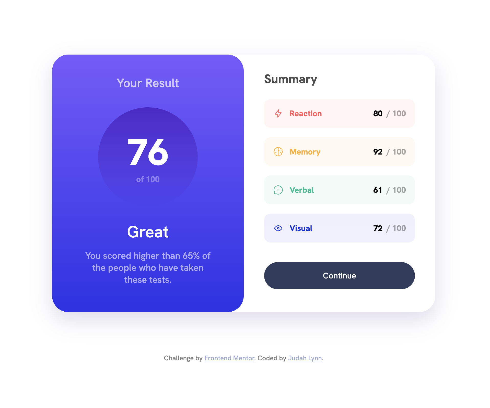

# Frontend Mentor - Results summary component solution

This is a solution to the [Results summary component challenge on Frontend Mentor](https://www.frontendmentor.io/challenges/results-summary-component-CE_K6s0maV), and my VERY FIRST Frontend Mentor challenge. Totally ready for my next one...

## Table of contents

- [Frontend Mentor - Results summary component solution](#frontend-mentor---results-summary-component-solution)
  - [Table of contents](#table-of-contents)
  - [Overview](#overview)
    - [The challenge](#the-challenge)
    - [Screenshot](#screenshot)
    - [Links](#links)
  - [My process](#my-process)
    - [Built with](#built-with)
    - [What I learned](#what-i-learned)
    - [Continued development](#continued-development)
  - [Author](#author)

## Overview

### The challenge

Users should be able to:

- View the optimal layout for the interface depending on their device's screen size
- See hover and focus states for all interactive elements on the page

### Screenshot

### Links

<!-- - Solution URL: [Add solution URL here](https://your-solution-url.com) -->
- Solution URL: [Frontend Mentor](https://www.frontendmentor.io/solutions/responsive-summary-component-using-html-and-css-TP1ZsM-vfc)
- Live Site URL: [Github Pages](https://mindful108.github.io/frontendmentor-results-summary-component/)

## My process

I really liked the look of the desktop version of this design, which is what first caught my eye and pulled me into the challenge, so I did that first. I then refactored my CSS for a 'mobile first' approach, using a min-width breakpoint of 775px. I then took the design a little further for very small phones/devices down to 265px.

### Built with

My own hand-typed code using VS Code with some help from the Emmet extension. I tried to keep the code as simple and clean as possible.

- Semantic HTML5 markup
- CSS custom properties
- Flexbox

### What I learned

For me the big learning was just getting familiar with Frontendmentor.io and the process for completing and uploading projects. Next step is to begin contributing to the community by offering feedback on other challenges.

As far as code is concerned, it was good to practice with Flexbox and to refine my own web/frontend development process.

### Continued development

I will continue to practice and build-on my skills in HTML and CSS, just using Vanilla JavaScript right now for these projects when needed. I am now picking up Tailwind CSS and so may use that soon, the React for more JavaScript heavy challenges in the future.

## Author

- Website - [Judah Lynn](https://judahlynn.com)
- Frontend Mentor - [@mindful108](https://www.frontendmentor.io/profile/mindful108)